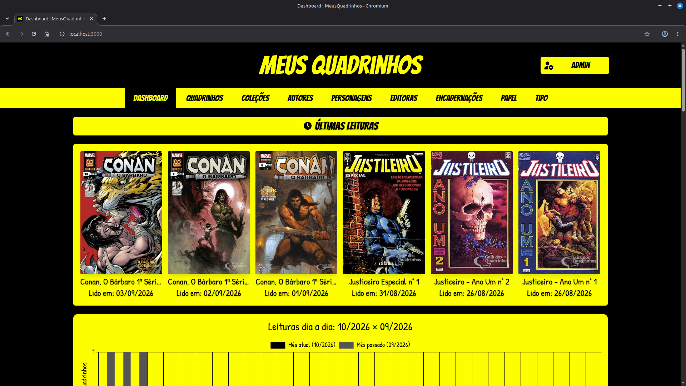

# Meus Quadrinhos



An app to catalog comics, build a personal collection, and track what you have read.

## 🛠️ Tech Stack


## ✨ Features

- Comic records with cover, issue, year, pages, and stories
- Catalog of collections, authors, characters, publishers, bindings, paper types, and comic types
- Personal collection per user
- Reading log
- Dashboard with totals, reading streak, and charts
- User authentication
- Admin area
- Catalog export as JSON

## 🚀 Getting Started

### 1. Install system dependencies

- Ruby 3.3.0
- PostgreSQL
- Node.js and Yarn
- ImageMagick

This might help you:

- [Ruby setup](https://phzsantos.github.io/posts/ruby-setup/)
- [How to install PostgreSQL on Linux Mint](https://phzsantos.github.io/posts/how-to-install-postgresql-linux-mint/)
- [How to install Yarn on Linux Mint](https://phzsantos.github.io/posts/how-to-install-yarn-linux-mint/)

### 2. Install gems

```bash
bundle install
```

### 3. Install front-end packages

```bash
yarn install
```

### 4. Create and seed the database

```bash
bin/rails db:create
bin/rails db:migrate
bin/rails db:seed
```

The seed creates a local admin user:

- Email: `admin@admin.com`
- Password: `123456`

### 5. Run the application

```bash
bin/dev
```

The app runs at [http://localhost:3000](http://localhost:3000).

## 📄 License

This project is licensed under the **GNU Affero General Public License v3.0**.
